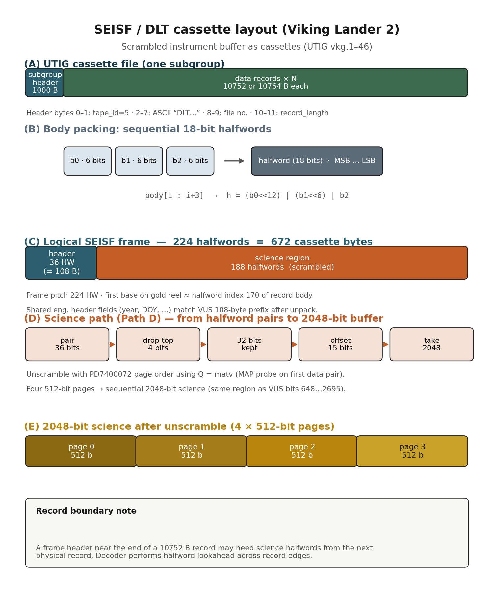
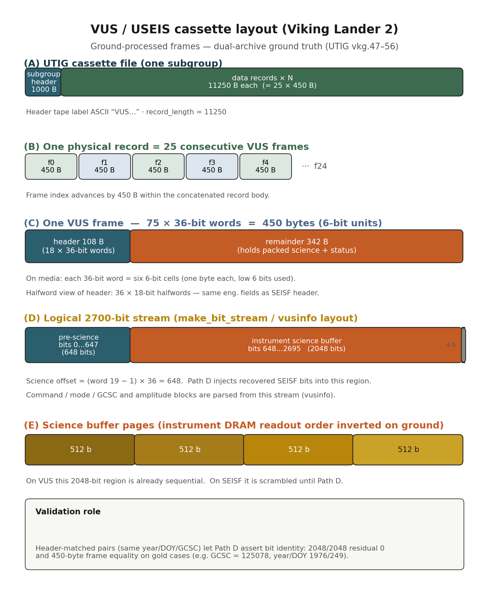
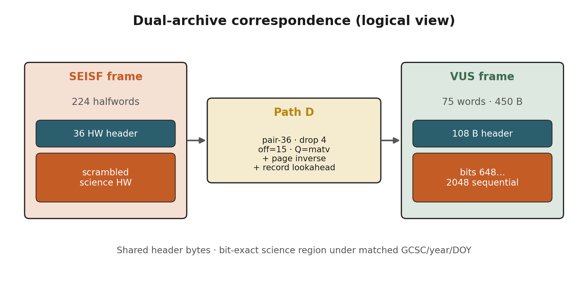

# Viking Lander 2 SEISF cassette decoder

[](LICENSE)

Recover **bit-exact** 2048-bit science frames from scrambled **SEISF (DLT)** UTIG cassettes (`vkg.1`–`46`), validated against matched **VUS (USEIS)** frames (`vkg.47`–`56`).

**Organization:** [isas-yamamoto](https://github.com/isas-yamamoto) · **License:** MIT  
**Repository:** `https://github.com/isas-yamamoto/vl2-seisf-decode`

## Decode pipeline (summary)

1. Pack consecutive 18-bit halfwords as 36-bit pairs; **drop the top 4 bits** → 32 bits/pair
2. Stream offset **15**, length 2048
3. Unscramble with PD7400072 order using **Q = matv** (MAP probe), covering all three page-readout cases (Q < 503, Q = 503, Q > 503)
4. Stitch halfwords across physical record boundaries when needed

Gold check (local `utig/vkg.1` + `vkg.47`): residual **0/2048**, frame equality, GCSC **125078**.

Across all header-matched SEISF/VUS pairs: **421/423** bit-exact, closing most of the VUS coverage gap (VUS-unique-header coverage **99.0%**; SEISF-unique-header coverage **74.5%**, reflecting SEISF's larger 46-file span vs. VUS's 10).

## Quick start

```bash
mkdir -p utig && cp /path/to/vkg.1 /path/to/vkg.47 utig/

cd src
python3 test_regression.py
python3 decode_vkg.py ../utig/vkg.1 --summary --max-frames 20
```

Python 3.9+, standard library only. Cassette images are **not** shipped.

## Data

`vkg.1`–`vkg.56` are archived at DARTS (ISAS/JAXA): https://data.darts.isas.jaxa.jp/pub/viking/utig/

## Layout

| Path | Contents |
|------|----------|
| `src/` | Decoder, CLI, regression tests |
| `vusinfo/` | Original VUS C decoder (Yukio Yamamoto), first-party |
| `materials/` | Curated PDFs + `N51SUB.jpg` |
| `docs/` | Operator docs + **format diagrams** (`docs/figures/`) |

## Format diagrams

| | |
|--|--|
| SEISF / DLT |  |
| VUS / USEIS |  |
| Dual-archive map |  |

Details: [docs/figures/README.md](docs/figures/README.md)

## Documentation

- English: [docs/usage.md](docs/usage.md)
- 日本語: [docs/usage.ja.md](docs/usage.ja.md)

## Cite / materials

- `CITATION.cff`
- Provenance: `NOTICE` (UTIG web PDFs; N51SUB photo from paper at UTIG)
- License: `LICENSE` (MIT for software)

A scholarly paper draft, if any, is maintained in a **separate repository**, not here.
